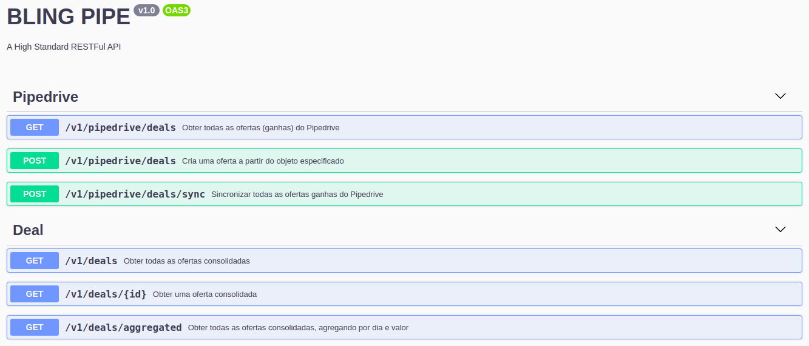
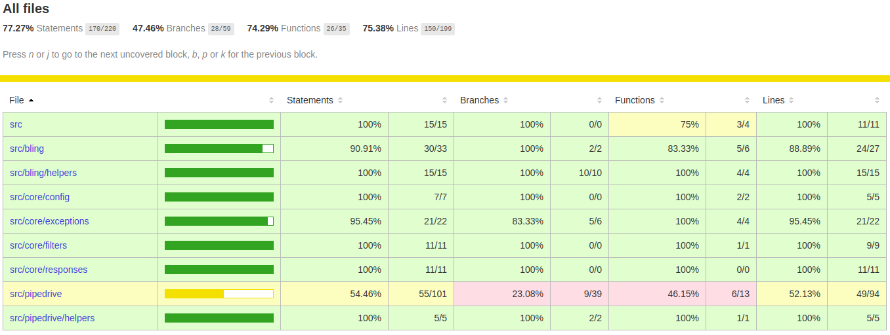

# RESTFul API

A High Standard RESTFul API for LinkApi technical test.

The main objective was to integrate with Pipedrive and Bling platforms.

The project is hosted on Heroku. It is still in development, but you can already check it at the link below:

- linkapi-test.herokuapp.com
  - [/v1 - First version](https://linkapi-test.herokuapp.com/v1/)
  - [/docs - OpenAPI](https://linkapi-test.herokuapp.com/docs/)

## :arrow_down: Installation

```bash
$ yarn install
```

## :rocket: Running the app

```bash
# development
$ yarn start

# watch mode
$ yarn start:dev

# production mode
$ yarn start:prod
```



> http://localhost:3000/docs

## :heavy_check_mark: Test

```bash
# unit tests
$ yarn test

# e2e tests
$ yarn test:e2e

# test coverage
$ yarn test:cov
```



> Code coverage generated by istanbul at Fri Jun 26 2020 05:10:43 GMT-0300

## Stay in touch

- Author - [Wender Machado](https://www.linkedin.com/in/wenderpmachado)

## :memo: License

This project is under the MIT license. See the archive [LICENSE](LICENSE.md) for more details.
